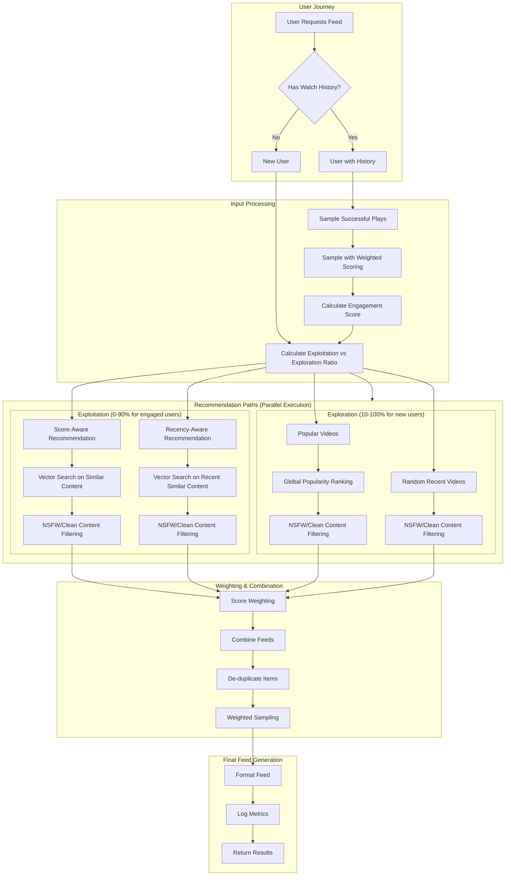

# yral-ml-feed-server

```mermaid
flowchart TD
    subgraph User["User Journey"]
        U[User Requests Feed]
        WH{Has Watch History?}
        UWH[New User]
        UWH2[User with History]
    end

    subgraph Input["Input Processing"]
        SP[Sample Successful Plays]
        SWS[Sample with Weighted Scoring]
        CS[Calculate Engagement Score]
        CE[Calculate Exploitation vs Exploration Ratio]
    end

    subgraph RecommendationPaths["Recommendation Paths (Parallel Execution)"]
        subgraph Exploitation["Exploitation (0-90% for engaged users)"]
            SAR[Score-Aware Recommendation]
            VS[Vector Search on Similar Content]
            NFILTER1[NSFW/Clean Content Filtering]
            RAR[Recency-Aware Recommendation]
            RVS[Vector Search on Recent Similar Content]
            NFILTER2[NSFW/Clean Content Filtering]
        end

        subgraph Exploration["Exploration (10-100% for new users)"]
            PV[Popular Videos]
            GPV[Global Popularity Ranking]
            NFILTER3[NSFW/Clean Content Filtering]
            RR[Random Recent Videos]
            NFILTER4[NSFW/Clean Content Filtering]
        end
    end

    subgraph Weighting["Weighting & Combination"]
        SW[Score Weighting]
        CF[Combine Feeds]
        DD[De-duplicate Items]
        WS[Weighted Sampling]
    end

    subgraph FinalFeed["Final Feed Generation"]
        FF[Format Feed]
        LOG[Log Metrics]
        RES[Return Results]
    end

    U --> WH
    WH -- No --> UWH
    WH -- Yes --> UWH2
    UWH --> CE
    UWH2 --> SP
    SP --> SWS
    SWS --> CS
    CS --> CE

    CE --> RecommendationPaths
    
    CE --> SAR
    SAR --> VS
    VS --> NFILTER1
    
    CE --> RAR
    RAR --> RVS
    RVS --> NFILTER2
    
    CE --> PV
    PV --> GPV
    GPV --> NFILTER3
    
    CE --> RR
    RR --> NFILTER4
    
    NFILTER1 --> SW
    NFILTER2 --> SW
    NFILTER3 --> SW
    NFILTER4 --> SW
    
    SW --> CF
    CF --> DD
    DD --> WS
    
    WS --> FF
    FF --> LOG
    LOG --> RES
```